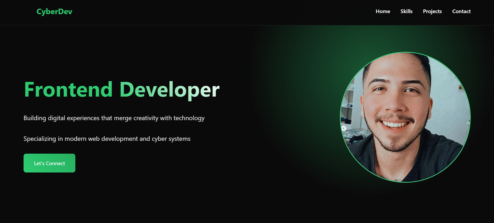

# 🌐 CyberDev Portfólio | Desenvolvedor Frontend 

✨ **Criando experiências digitais que unem criatividade e tecnologia** ✨



---

## 🚀 **Visão Geral do Projeto**  
Bem-vindo ao meu portfólio profissional! Este projeto destaca minha experiência como Desenvolvedor Frontend com foco em desenvolvimento web moderno e cibersegurança. O portfólio foi projetado para exibir minhas habilidades, projetos e oferecer uma maneira fácil de entrar em contato comigo.

---

## 🛠️ **Principais Funcionalidades**  
- **Design Responsivo**: Otimizado para todos os dispositivos (Desktop/Tablet/Mobile).  
- **Seções Dinâmicas**:  
  - 🏠 Início: Seção inicial limpa com uma introdução profissional.  
  - ⚡ Habilidades: Exibição interativa das competências técnicas.  
  - 📂 Projetos: Estudos de caso com snippets de código e demonstrações ao vivo.  
  - 📩 Contato: Formulário fácil de usar e links para redes sociais.  
- **Otimizado para SEO**: Carregamento rápido, meta tags e conteúdo rico em palavras-chave.  
- **Integração com Sistemas Cibernéticos**: Demonstração de implementações de projetos de cibersegurança.  

---

## 💻 **Tecnologias Utilizadas**  
- **Frontend**: HTML5, CSS3, JavaScript (ES6+), React.js  
- **Estilização**: Sass, Módulos CSS, Bootstrap  
- **Ferramentas**: Webpack, Git, npm  
- **Deploy**: Netlify, Vercel  
- **SEO**: Google Analytics, Otimização com Lighthouse  

---

## 📁 **Estrutura do Projeto**  
```bash
├── public/               # Arquivos estáticos
├── src/                  
│   ├── components/       # Componentes reutilizáveis da interface
│   ├── pages/            # Layouts das páginas (Início, Projetos, etc.)
│   ├── styles/           # Arquivos globais de CSS/Sass
│   └── utils/            # Funções auxiliares
├── .gitignore            
├── package.json          
└── README.md             
